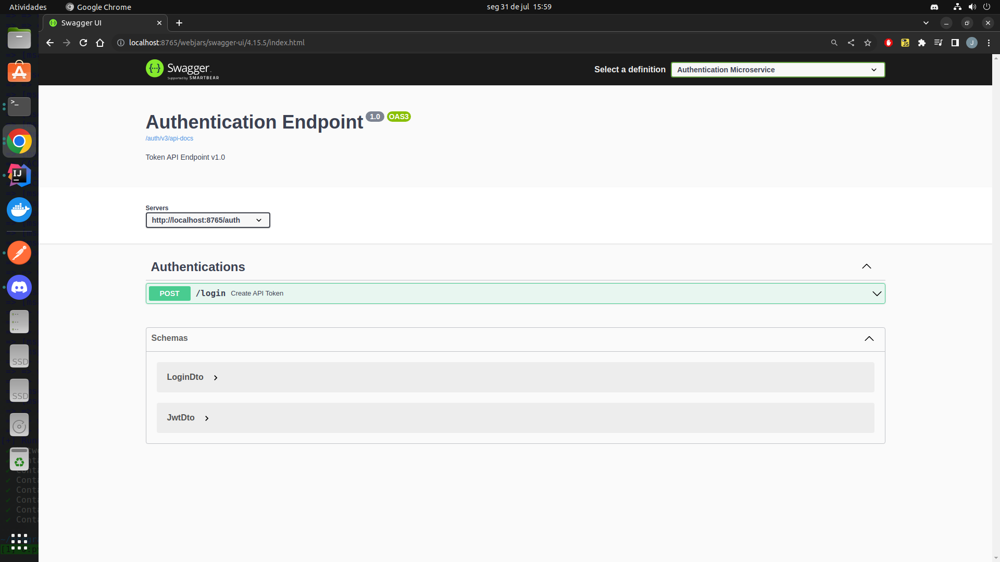
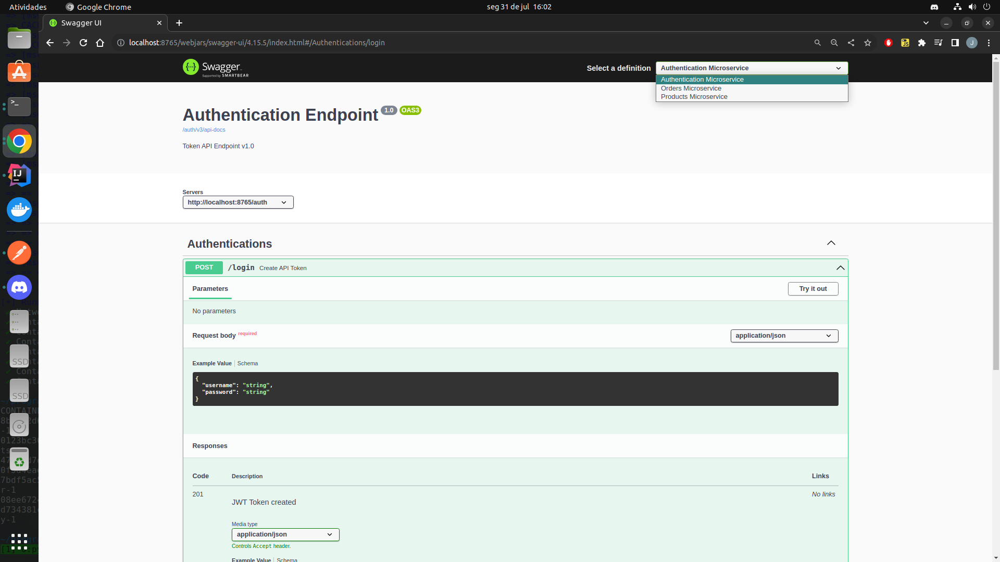
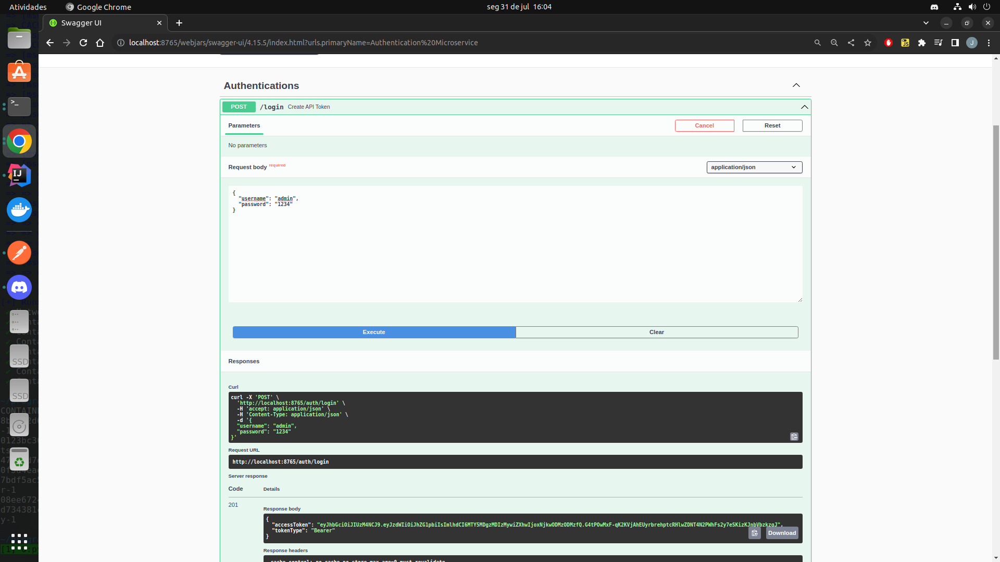
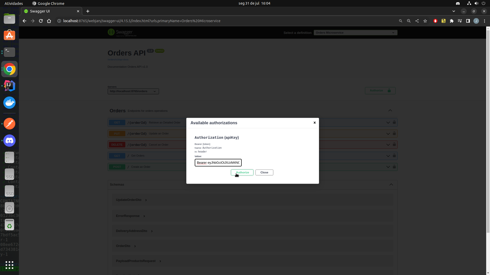
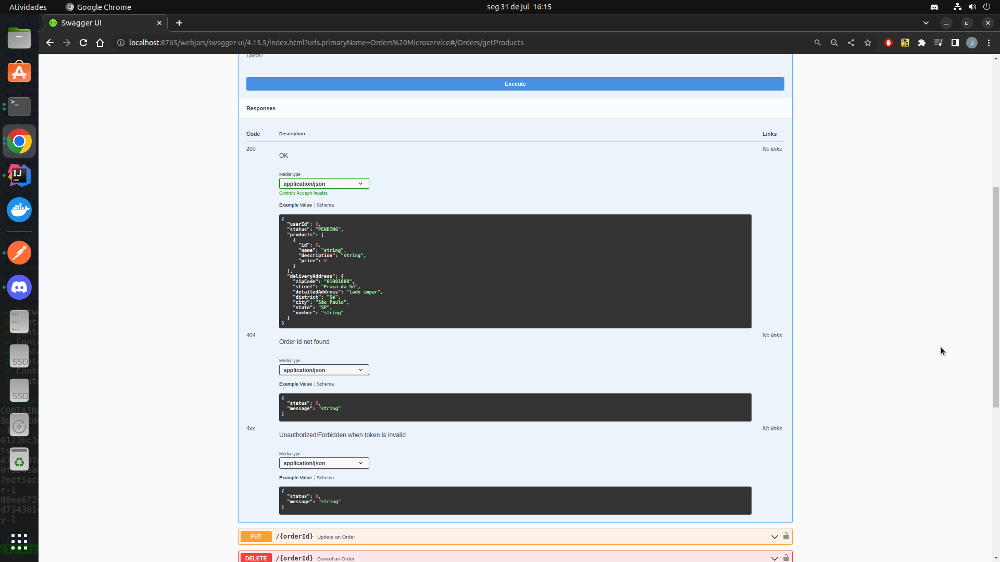
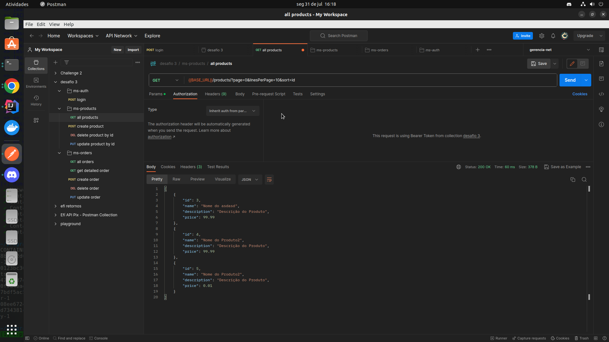
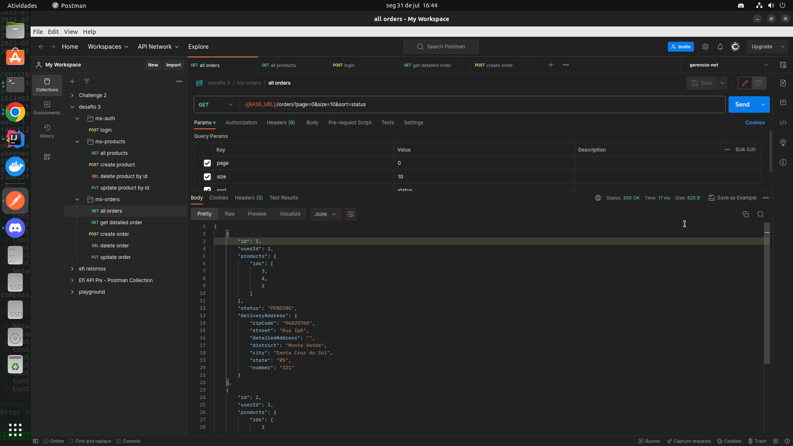
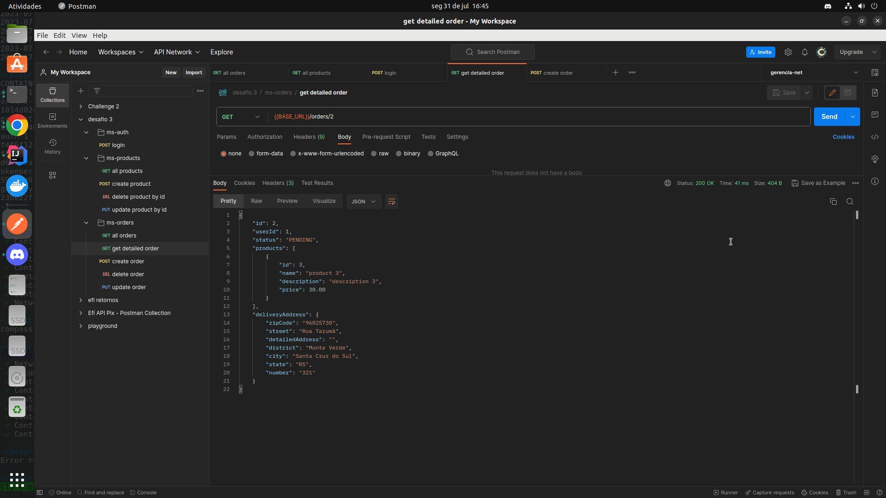

# Desafio 03 Programa de Bolsas Compasso UOL

## Spring Boot / AWS

### Jonathan Santos

---

## Table of Contents

1. [Project Description](#project-description)
2. [How to run the project](#how-to-run-the-project)
    1. [Docker](#docker)
    2. [Local](#local)
    3. [credentials](#credentials)
3. [Images](#images)
   1. [Swagger](#swagger)
   2. [Auth](#auth)
   3. [Products](#products)
   4. [Orders](#orders)

## Project Description <a name = "project-description"></a>

This project was developed for the Compasso UOL Programa de Bolsas.
The project is a simple API that allows the user to register and sell projects in an e-commerce way.
Built with Spring Boot and documented with Swagger, the project uses the microservice architecture to separate the
responsibility of each service.
The services are: ms-order, ms-product, and ms-auth.
The ms-order is the main service
and is responsible for the business rules and the communication with the other services.
The ms-product is responsible
for the product management and the ms-auth is responsible for the authentication and creation of the JWT token.
To make requests to the API, the user must communicate with the ms-gateway service, that will authenticate the token
and redirect the request to the correct service.

The complete documentation of the API can be found in the link below:
http://localhost:8765/swagger-ui.html

Also, the project has a Postman collection with examples of requests to the API.
The collection can be found in the
main directory of the project, with the name `challenge03.postman_collection.json`.

## How to run the project <a name = "how-to-run-the-project"></a>

There are two ways to run the project: with Docker or local, we gona start with the Docker way.

> _**Note:**_ Installation of the docker tools isn't covered in this tutorial, so make sure you have docker
> and docker compose installed

### Docker <a name = "docker"></a>

To run the project with Docker, we're going to use the `docker compose` command.
This command will build and run all the
containers needed to run the project.
Follow the steps below to run the project:

1. Open the terminal and navigate to the main project directory.
2. Run the following command:
   ```shell
     docker-compose up -d 
   ```
3. Wait for the containers to be built and run, this can take a while.

Some important considerations about the Docker Compose file: the postgres database is configured to run in the port
`5432` internally and `25432` externally, so if you want to connect to the database externally, use the port `25432`.
The change of
the port was made to avoid conflicts with other databases that could be running in the same machine.

### Local <a name = "local"></a>

To run the project locally, we're going to need an instance of the postgres database running in the port `25432` with
the user `postgres` and password `postgres`.
If you want to change the database configuration, you can change the
`application.yml` each of the services, i keeped the port `25432`so you can run locally with the database container.
After
the database is running, we need to run the scripts in the `db` to create the tables and populate the database with
data.

After the database is running and populated, we need a Kafka instance running in the port `29092`.
The Docker Compose file has a Kafka instance configured, so if you want to use it, you can run just the Kafka and
Zookeeper containers.
If you already have a Kafka instance running, you can change the port in the same way as the
database.

With the database and Kafka running, we can start all the services.

### Credentials <a name = "credentials"></a>

* **ms-auth**
  * username: admin
  * password: 1234

* **postgres**
    * username: postgres
    * password: postgres


## Examples <a name = "examples"></a>

### Swagger <a name = "swagger"></a>

Here is the link to the swagger documentation: http://localhost:8765/swagger-ui.html
- The first page of the documentation:



- You can access the documentation of each service by clicking on `Select a definition` in the top right corner:



- To make a request to the services you first need to authenticate, to do that you need to issue to the `/auth/login`:



- After you get the token, you need to click on the `Authorize` button and paste the token in the input field:



- The possible responses of the services are documented in the swagger documentation like the example below:



### Auth <a name = "auth"></a>
All the requests to the API using Postman are autheticated with a pre-script that gets the token from the `/auth/login`,
so you don't need to worry about the authentication (if the scripts in db/ are runned).

### Products <a name = "products"></a>
Some examples of requests to the products service:

- Get all products:



### Orders <a name = "orders"></a>
Some examples of requests to the orders service:

- Get all orders:



- Get order by id:

